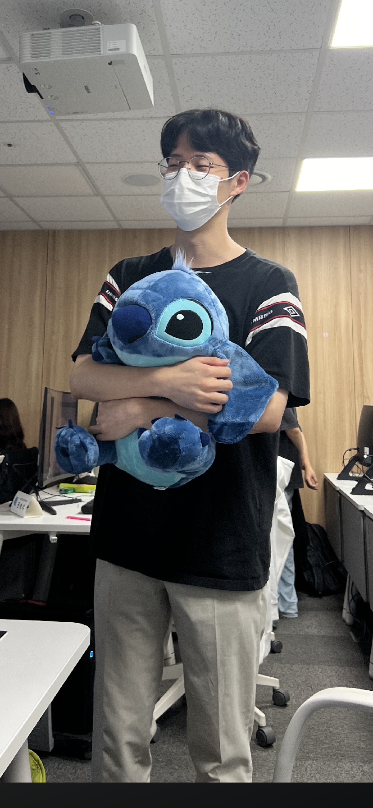
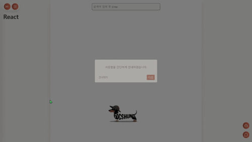

</img>

# 🐕 모든 개발자의 공식문서 완전정복, DOCSHUND가 함께할게요! 🐕

닥스훈트(DOCSHUND)는 국내 개발자를 위한 웹사이트로, 외국어로 된 `IT공식문서를 한국어로 함께 번역`하는 공간과 국내 개발자들과 함께 `공식문서와 기술에 대해 이야기할 수 있는 커뮤니티`를 제공하는   기반의 서비스입니다.

 

이 프로젝트는 2025년 1월부터 2월까지 진행된 `삼성 청년 소프트웨어 아카데미(Samsung Software Academy For Youth, SSAFY)` 12기 2학기 공통 프로젝트 산출물입니다.

 

## 🎬 소개 영상

<!--  -->
[Dochund UCC 링크](https://youtu.be/vpjdXrrvcJs)

 

## 🪄 기술 스택

### Server

### Client

### Database

### Infra

### Version Control & Tools

 

## 👤 팀원 정보 및 업무 분담 내역

### 프론트엔드 (Front-end)

|   Name   | 조홍균 👑팀장                                                                                             | 이시호 🎖️FE리더                                                                                                                           | 김서현                                                                                                                                      |
| :------: | --------------------------------------------------------------------------------------------------------- | ----------------------------------------------------------------------------------------------------------------------------------------- | ------------------------------------------------------------------------------------------------------------------------------------------- |
| Profile  | 

 | 

 | 

 |
| Position | Front-end Develop / PM                                                                                    | Front-end Develop / PL                                                                                                                    | Front-end Develop / Design                                                                                                                  |
|   Git    | [@NekoShoot](https://github.com/NekoShoot)                                                                | [@harimau97](https://github.com/harimau97)                                                                                                | [@seohye-ki](https://github.com/seohye-ki)                                                                                                  |
|  E-mail  | honggyunjo1109@gmail.com                                                                                  | harimau97@gmail.com                                                                                                                       | seohyeon.shkim@gmail.com                                                                                                                    |

 

`조홍균`

- **Project Management 수행**
  1. Jira를 활용한 팀의 Gantt 차트 제작 및 스프린트 기반 일정 계획 수립 및 진행
  2. 일 2회 스크럼을 통한 프로젝트 진행 파악 및 이슈 공유로 프로젝트 협업 독려
  3. Notion을 활용한 기록 및 버저닝 관리로 프로젝트의 프로세스 전반적으로 관리
  4. Discord/카카오톡으로 소통 채널을 분리해 프로젝트 관련은 Discord에서, 개인적인 부분은 카카오톡을 통해 자유롭게 소통할 수 있게 관리
  5. 담당 컨설턴트/실습코치/운영프로와 팀원간의 소통을 연결해 최대한 빠르고 정확하게 이슈를 주고 받을 수 있도록 관리
  6. 1:1 소통 및 FE/BE 별 소통을 통해 팀원들의 고충과 이슈를 이해하고 해결하기 위해 노력
- **커뮤니티 페이지 설계 및 기능 구현**

  1. 기본적인 CRUD 기능 구현
  2. SPA의 강점인 새로고침 없는 부드러운 경험을 극대화하기 위해 비동기 데이터에 대한 리렌더링 로직 구현
  3. 렌더링 되는 시간 동안 발생하는 깜빡임 이슈를 해결하기 위한 스켈레톤 컴포넌트 도입

- **공통 컴포넌트 및 훅 리팩토링**

  1. List 형태로 반환되는 데이터를 일관성 있는 방식으로 렌더링 하기 위한 listRender 컴포넌트 리팩토링
  2. 페이지네이션을 위한 pagination 컴포넌트 리팩토링
  3. 날짜를 Asia/Seoul로 맞춰주는 useKoreaTime 훅 개발 및 리팩토링
  4. 유저의 악의적인 파일 input을 막기 위해 byte타입을 체크하는 useFileTypeCheck 훅 개발 및 리팩토링

- **SSE를 활용한 알림 연결 및 로직 구현**
  1. hook 안에서 toast가 뜨지 않는 현상을 수정하기 위해 렌더링+스크립트 구동 시간을 12 프레임 안에서 동작하게 하는 requestAnimationFrame()을 활용해 UI 업데이트 최적화
  2. 실시간 알림 수신에 따라 즉각적인 반응형 알림 컴포넌트 제작

`이시호`

- **번역 뷰어 페이지 설계 및 기능 구현**
  
  1. indexedDB 사용: 사용자가 최초 데이터 수신 후 서버와 통신 없이 원문 데이터를 조회 가능
  2. 대량의 데이터를 효율적으로 렌더링 하기 위해 무한 스크롤 적용 &rightarrow; windowing 방식으로 변경
     - react-virtuoso 라이브러리를 사용하여 화면에 보이는 영역만 렌더링
     - 검색 및 문단 이동 기능 구현
  3. 마크업/마크다운 문법을 지원하는 에디터/뷰어를 적용
  4. 사용자 편의를 위한 기능 투어 구현
     - react-joyride 라이브러리를 이용
     
- **챗봇 프롬프팅 및 UI 구현**
  
  1. 챗봇 창에서 마크업 언어를 렌더링하여 코드 블록과 개행을 구분
     - 마크업/마크다운 문법을 지원하는 뷰어를 메시지에 적용하여 가독성 극대화
  2. 사용자는 텍스트 기반 문서를 더욱 명확하게 이해할 수 있음
  3. 프롬프팅을 통해 개발 및 번역에 특화시킴
     
- **관리자 페이지 설계 및 기능 구현**
  
  1. 회원 관리, 신고 관리, 문의 관리, 문서 작성 기능 구현

`김서현`

- **반응형 웹디자인 (Tailwind CSS 적용)**

  1. Tailwind CSS를 활용하여 빠르고 효율적인 반응형 디자인 구현
  2. 모바일, 태블릿, 데스크톱에서 최적화된 UI 제공
  3. 디자인 툴로 Figma 사용

- **로그인/로그아웃/회원탈퇴**

  1. OAuth2 인증 방식을 이용하여 Google, GitHub 소셜 로그인 지원

- **마이페이지/유저페이지**

  1. 프로필 설정: 프로필 이미지 변경, 닉네임 변경, 관심 분야 설정, 자기소개 작성 가능
  2. 보관함(좋아요한 콘텐츠): 좋아요를 누른 게시글, 번역본, 문서를 모아볼 수 있으며, 좋아요 취소 가능
  3. 나의 활동: 내가 작성한 번역본, 게시글, 댓글을 볼 수 있으며, 클릭 시 해당 글로 이동. 작성한 번역본은 모달을 통해 원문과 번역본을 함께 확인 가능
  4. 나의 문의: 내가 보낸 문의 내역 확인 가능 (답변 완료/답변 대기 상태 확인 가능)
  5. 유저페이지에서 해당 유저의 활동내역과 프로필을 확인할 수 있음

- **메모장**

  1. react-md-editor를 사용하여 Markdown/Markup 지원
  2. 번역 문서에서 사이드바에서 메모 작성 가능
  3. 사이드바에서 최근 작성된 최신 3개 메모 미리보기 제공

- **문서별 실시간 채팅 (STOMP.js 사용)**

  1. STOMP.js를 이용하여 문서별 실시간 채팅 구현
  2. WebSocket을 활용하여 실시간 데이터 전송
  3. 처음 접속 시 최신 50개 채팅 내역 로드
  4. 이전 채팅은 스크롤을 위로 올리면 점진적으로 로드
  5. 사용자가 메시지를 보내면 자동으로 최하단 이동
  6. 다른 사용자가 메시지를 보낼 때 사용자가 과거 메시지를 보고 있으면 자동 스크롤 방지, 하지만 하단에 있을 경우 즉시 새 메시지 표시

- **문의**

  1. 회원/비회원 모두 문의 가능
  2. 로그인한 경우, 문의 이메일 자동 입력
  3. 문의 등록 시 로딩 화면 구현 (메일 전송 대기 처리)

- **공지사항/FAQ/이용약관/개인정보처리방침**

  1. Toast UI Editor를 사용하여 가독성 높인 뷰어 제공

- **Axios Instance 및 Router Guard**
  1. Axios instance를 활용하여 모든 API 요청에 자동으로 Header에 토큰 포함. API 응답 오류 시 오류 페이지로 이동하는 로직 구현
  2. Router Guard를 작성하여 비로그인 시 접근 불가한 페이지 접근 차단
  

 

---

### 백엔드 (Back-end)

|   Name   | 이경훈 🎖️BE리더                                                                                                                             | 이승연                                                                                                     | 정지은                                                                                                                                       |
| :------: | ------------------------------------------------------------------------------------------------------------------------------------------- | ---------------------------------------------------------------------------------------------------------- | -------------------------------------------------------------------------------------------------------------------------------------------- |
| Profile  | 

 | 

 | 

 |
| Position | Back-end Develop / PL                                                                                                                       | Back-end Develop / Infra                                                                                   | Back-end Develop / Document                                                                                                                  |
|   Git    | [@TinyFrogs](https://github.com/TinyFrogs)                                                                                                  | [@leesyseel](https://github.com/leesyseel)                                                                 | [@doh3e](https://github.com/doh3e)                                                                                                           |
|  E-mail  | qns0147@gmail.com                                                                                                                           | leesyseel@gmail.com                                                                                        | wldms3333@gmail.com                                                                                                                          |

 

여기는 백엔드 역할 및 담당 소개

`이경훈`

- Spring Security + OAuth2.0을 이용한 Github, Google 로그인 구현
- Java Mail Sender와 Hunter IO API를 사용한 메일 전송 및 이메일 도메인 체크 서비스 구현
- S3를 사용한 이미지 업로드 구현
- Apache Tika를 이용한 바이너리 데이터 이미지 체크 기능 구현
- SSE Connection pool 구현
- Jenkins를 이용한 Backend CD 구현
- QueryDSL를 이용한 동적 쿼리 구현

`이승연`

- QueryDSL을 사용한 게시글 CRUD와 좋아요 기능
- JPQL을 사용한 댓글 CRUD
- 내부 브로커 사용한 STOMP 실시간 채팅 구현
- Certbot 컨테이너 이용 Let's Encrypt 인증서 발급
- Nginx 리버스 프록싱 (tls 인증과 요청 매핑)
- Jenkins 이용한 Frontend CD 구현 및 전체 파이프라인 실시간 알림 구축
- 배포 인프라 컨테이너들의 Docker Compose 파일 작성 및 구축

`정지은`

- Document 및 Document에 연결된 테이블 관계 설계
- 문서 번역 Back-end REST API 작업

  1. 관리자 모드에서의 문서 CD 로직 및 유저 번역 CR, 좋아요 로직
  2. Python 라이브러리 (Beautifulsoup)를 통한 공식 문서 html 코드 파싱으로 핵심 코드(`p`, `code` `h` 등...)별 분리 성공 -> 유저 번역 시 번역을 문단별로 쉽게 끊어서 할 수 있게끔 유도
  3. QueryDSL을 활용한 문서별 베스트 번역 조회 로직 구현

- 실시간 알림 파트 SSE (Server Sent Event) 백엔드 연결 로직 구현

  1. 번역에 좋아요, 게시글에 댓글, 댓글에 대댓글, 문의에 답글 생성 시 event 가 send 되도록 구현
  2. 프론트엔드에서 이벤트를 수신받을 수 있게함과 동시에 Alert DB에 저장
  3. SSE 구독 과정에서 유저를 조회할 때, 기존 프로젝트 세팅과 SSE의 불필요한 DB 점유로 인해 connection pool 오류 발생
     => CS 지식과 프로젝트 경험 부족으로 스스로 오류의 원인을 찾지 못해 다른 BE들의 도움으로 오류를 해결했으나, 추후 이와 같은 문제에 대해 대처할 수 있는 귀중한 경험을 얻음

- 개인 메모장 CRUD Back-end REST API 작업
- 사이트 내 공식문서 및 게시글, 번역글 더미데이터 삽입
- ReadMe 초안 작업
- 영상 포트폴리오 작업

 

## 💾 데이터베이스 모델링(ERD)

 

## 📜 프로젝트 구조

 

## 🔧 구현 목표 및 실제 구현도

이곳엔 구현 목표와 실제 구현도가 들어갑니다.

 

## 🪛 기술적 설명

### 메인화면

- 메인화면

### 회원관리

- 로그인

- 마이페이지

 

---

 

### 문서번역

- 문서리스트

- 기능 투어

- 문서번역

 

---

 

### 커뮤니티

 

---

 

### 채팅 및 실시간 알림

- 채팅

- 챗봇

- 실시간 알림

 

---

 

### 기타

- 메모

 

---

 

## 🏂 트러블 슈팅

### 상태 관리 문제 - ZUSTAND (Front-end)

- 📌Problem  
  SPA의 장점을 극대화 하기 위해서 새로고침을 지양하다보니 store에 저장해둔 전역 상태가 다른 컴포넌트로 이동했을 때도 남는 경우가 많았습니다.
  이는 대부분 버그의 원인이었고, 이를 디버깅하고 리팩토링하는데 많은 시간을 투자해야 했습니다.
- ✅ 해결책 분석  
  useEffect()와 같은 훅을 사용해서 store에 있는 값을 불러오고 저장할 때, 미리 내용을 비우거나 cleanUp()을 추가해서 unMount 될 때 지우는 로직이 있는 것이 중요합니다.
  특히, 리액트의 비동기 렌더링을 고려했을 때 같은 훅 안에서는 상태가 즉시 변하지 않기 때문에 이를 주의해서 로직을 설계해야 합니다.

### DBConnection Pool && SSE 문제 (Back-end)

- 📌Problem  
  SSE 연결을 유지하는 동안 DB Connection도 유지되며 
  사용자가 새로고침하면 SSE가 다시 연결되며, Connection Pool가 과부하된다 
  DB Connection이 불필요하게 점유되어 DB 연결이 불가피해지는 상황 발생
- ✅ 해결책 분석  
  SecurityContextHolder 사용하여 현재 로그인된 유저 정보를 유지할 수 있다 
  SSE 연결할 때 DB Connection을 아예 생성하지 않기 때문에 불필요한 점유가 사라지게 된다

---
