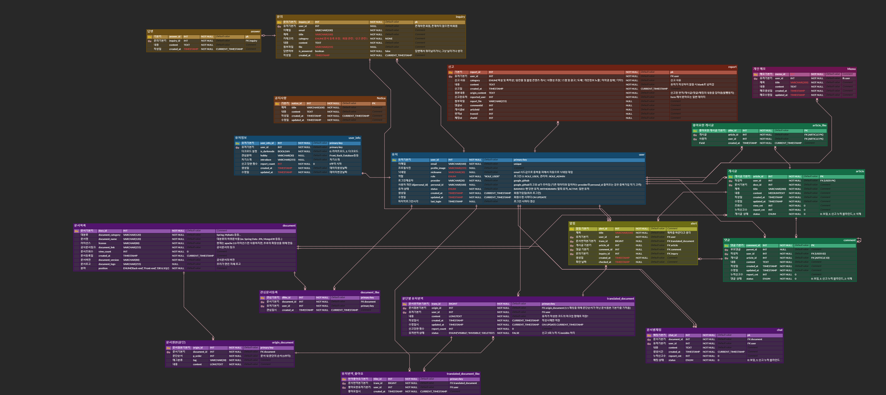
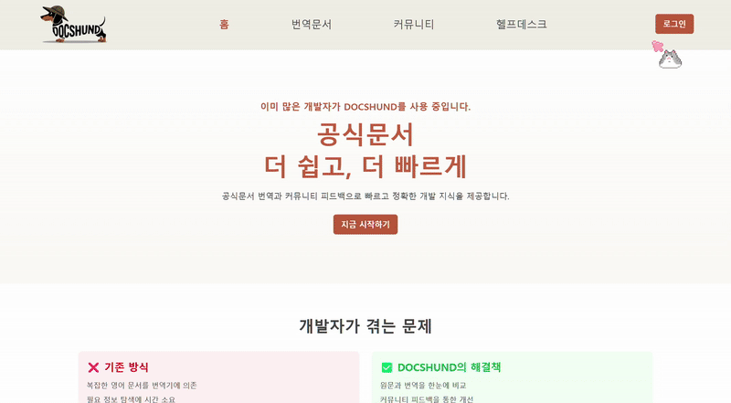
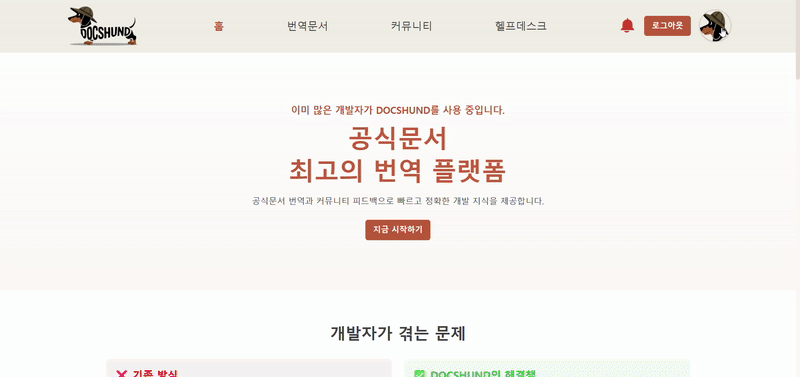
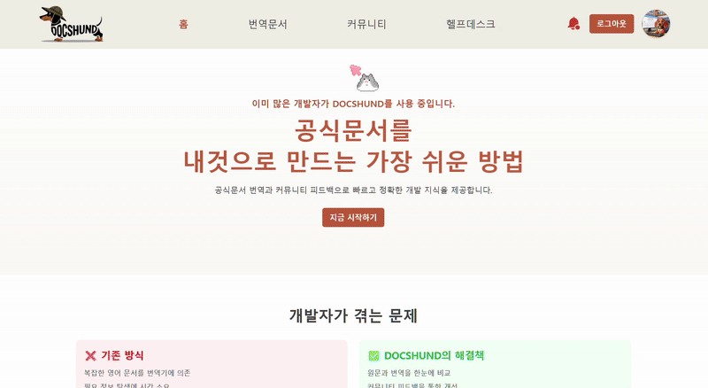
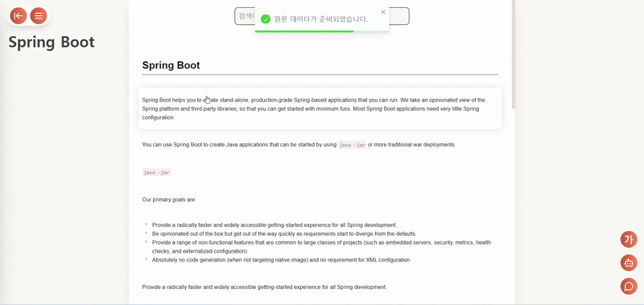
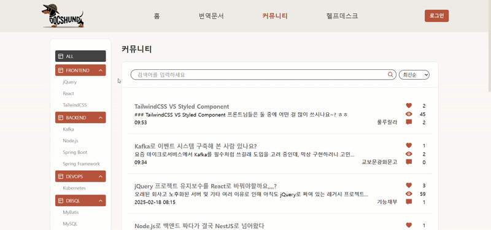
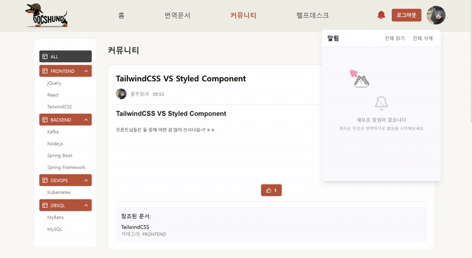
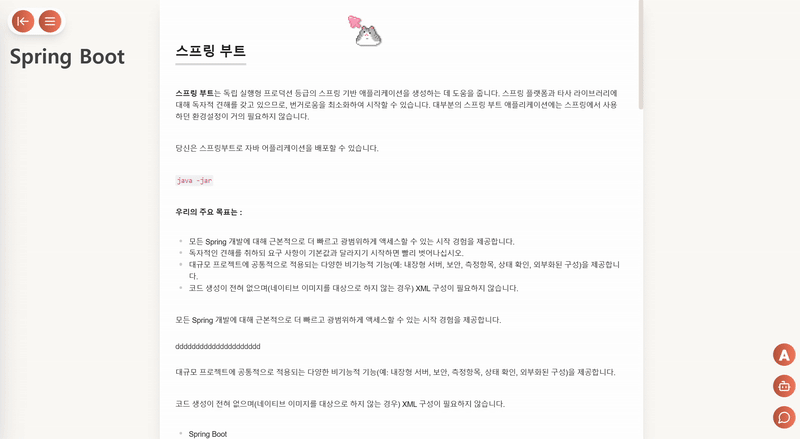

</img>

# 🐕 Are there any Korean here? Join with DocshunD! 🐕

닥스훈트(DocshunD)는 국내 개발자를 위한 웹사이트로, 외국어로 된 `IT공식문서를 한국어로 함께 번역`하는 공간과 국내 개발자들과 함께 `공식문서와 기술에 대해 이야기할 수 있는 커뮤니티`를 제공하는   기반의 서비스입니다.

 

이 프로젝트는 2025년 1월부터 2월까지 진행된 삼성 `청년 소프트웨어 아카데미(Samsung Software Academy For Youth, SSAFY)` 12기 2학기 공통 프로젝트 산출물입니다.

 

## 🎬 소개 영상

아직없음!

 

## 🪄 기술 스택

### Server

 

### Client

### Database

### Infra

### Version Control & Tools

 

## 👤 팀원 정보 및 업무 분담 내역

### 프론트엔드 (Front-end)

|   Name   | 조홍균 👑팀장                       | 이시호 🎖️FE리더                                  | 김서현                                           |
| :------: | ------------------------------------ | ------------------------------------------------- |-------------------------------------------------|
| Profile  |

|

|

|
| Position | Front-end Develop / PM  | Front-end Develop / PL  | Front-end Develop / Design |
|   Git    | [@깃허브](https://github.com/doh3e) | [@harimau97](https://github.com/harimau97) | [@seohye-ki](https://github.com/seohye-ki) |
|   E-mail    | email@gmail.com | harimau97@gmail.com | seohyeon.shkim@gmail.com |

 

여기는 프론트엔드 역할 및 담당 소개

 

---

### 백엔드 (Back-end)

|   Name   | 이경훈 🎖️BE리더                       | 이승연                                  | 정지은                                           |
| :------: | ------------------------------------ | ------------------------------------------------- |-------------------------------------------------|
| Profile  |

|

|

|
| Position | Back-end Develop / PL  | Back-end Develop / Infra  | Back-end Develop / Document |
|   Git    | [@TinyFrogs](https://github.com/TinyFrogs) | [@leesyseel](https://github.com/leesyseel) | [@doh3e](https://github.com/doh3e) |
|   E-mail    | qns0147@gmail.com | leesyseel@gmail.com |  wldms3333@gmail.com |

 

여기는 백엔드 역할 및 담당 소개

 

## 💾 데이터베이스 모델링(ERD)

 

## 📜 프로젝트 구조

 

## 🔧 구현 목표 및 실제 구현도

이곳엔 구현 목표와 실제 구현도가 들어갑니다.

 

## 🪛 기술적 설명

### 메인화면
- 메인화면

### 회원관리
- 로그인

- 마이페이지

 

---

 

### 문서번역
- 문서리스트

- 문서번역

 

---

 

### 커뮤니티

 

---

 

### 채팅 및 실시간 알림
- 채팅

- 챗봇

- 실시간 알림

 

---

 

### 기타

- 메모

 

---

 

## 🏂 트러블 슈팅

### 상태 관리 문제 - ZUSTAND (Front-end)
상태 관리 문제에 대한 것을 적으시면 됩니다.

### DBConnection Pool && SSE 문제 (Back-end)
- 📌Problem  
SSE 연결을 유지하는 동안 DB Connection도 유지되며 
사용자가 새로고침하면 SSE가 다시 연결되며, Connection Pool가 과부하된다 
DB Connection이 불필요하게 점유되어 DB 연결이 불가피해지는 상황 발생
- ✅ 해결책 분석  
SecurityContextHolder 사용하여 현재 로그인된 유저 정보를 유지할 수 있다 
SSE 연결할 때 DB Connection을 아예 생성하지 않기 때문에 불필요한 점유가 사라지게 된다

---